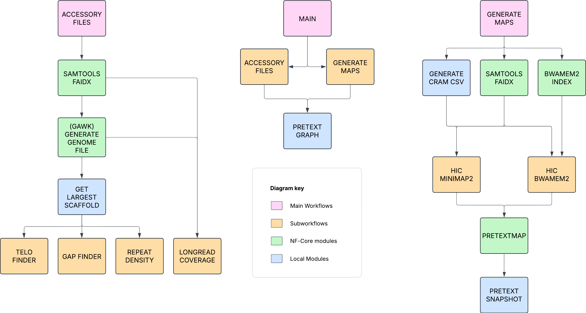
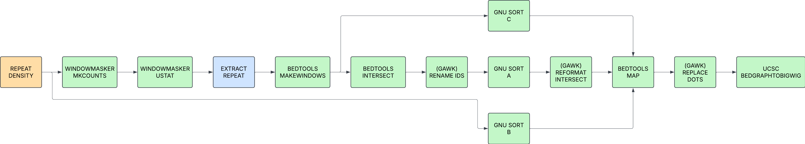
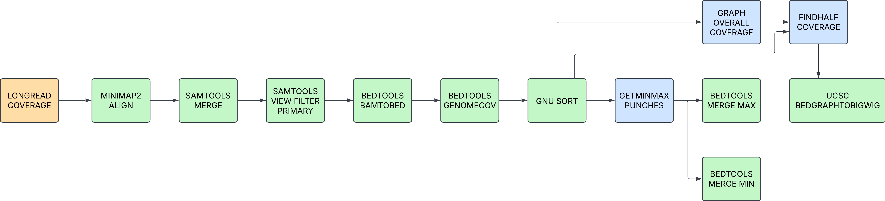

# sanger-tol/curationpretext: Output

## Introduction

This document describes the output produced by the pipeline.

The directories listed below will be created in the results directory after the pipeline has finished. All paths are relative to the top-level results directory.

## Pipeline overview

The pipeline is built using [Nextflow](https://www.nextflow.io/) and processes data using the following steps:

- [Generate Accessories](#generate-accessories) - Raw read QC
- [Generate Maps](#generate-maps) - Aggregate report describing results and QC from the whole pipeline
- [Pipeline information](#pipeline-information) - Report metrics generated during the workflow execution

The top level diagram of this pipeline is:

### Generate-Accessories

Output files

- `accessoriy_files/`
  - `coverage.bigWig`: Graph file containing coverage data. For Pretext ingestion.
  - `logcoverage.bigWig`: Graph file containing coverage data. For Pretext ingestion.
  - `halfcoverage.bigWig`: Graph file containing coverage data where coverage is equal to half the max.
  - `maxcoverage.bigWig`: Graph file containing coverage data where coverage is max.
  - `*_gap.bedgraph`: Bed graph with locations of gaps in the sequence. For Pretext ingestion.
  - `*_telomere.bed`: Bed file containing telomeric motif site.
  - `*_telomere.bedgraph`: Bed graph with locations of telomeric motif. For Pretext ingestion.
  - `*_repeat_density.bigWig`: Graph file containing relative repeat density across the genome. For Pretext ingestion.
  

The accessory files are generated by 4 sub workflows which are then ingested into the pretext files.

The subworkflows in question are: TELO_FINDER, GAP_FINDER, REPEAT_DENSITY, LONGREAD_COVERAGE.

#### TELO_FINDER

Identifies putative telomeric regions and creates a bed file for ingestion.

#### GAP_FINDER

Identified locations of gaps in sequence (via runs of N), calculates the length of runs and outputs a bedgrah file for ingestion.

#### REPEAT_DENSITY

Identified locations of repeat sequence and builds a bigwig file to sumarise the data.

#### LONGREAD_COVERAGE

Calculate the coverage across the assembly using longread data in fasta.gz format.

### Generate-Maps

Output files

- `pretext_maps_raw/`
  - `hic_hr.pretext`: A Hi-Res pretext file generated by PretextMap.
  - `hic_normal.pretext`: The standard pretext file generated by PretextMap.
  - `hic_normalFullMap.png`: A static image of the normal.pretext file.

These files are always generated by the pipeline and viewed in PretextView (a gui for pretext map manipulation). As the viewing of the pretext files can be memory intensive to load, we also generate a png for a quick glance. These now by default have the accessory files embedded into the pretext file.

This component of the pipeline, shown above as the top level diagram, uses the subworkflows HIC_MINIMAP2 and HIC_BWAMEM2 to align cram files to the assembly and generate a pretext map file that can then be ingested with the above accessory files.

#### HIC_MINIMAP2

#### HIC_BWAMEM2

### Processed Pretext

Output files

- `pretext_maps_processed/`
  - `hic_hr.pretext`: A Hi-Res pretext file generated by PretextMap.
  - `hic_normal.pretext`: The standard pretext file generated by PretextMap.

These files will have the accessory files ingested into them

### Pipeline information

Output files

- `pipeline_info/`
  - Reports generated by Nextflow: `execution_report.html`, `execution_timeline.html`, `execution_trace.txt` and `pipeline_dag.dot`/`pipeline_dag.svg`.
  - Reports generated by the pipeline: `pipeline_report.html`, `pipeline_report.txt` and `software_versions.yml`. The `pipeline_report*` files will only be present if the `--email` / `--email_on_fail` parameter's are used when running the pipeline.
  - Reformatted samplesheet files used as input to the pipeline: `samplesheet.valid.csv`.
  - Parameters used by the pipeline run: `params.json`.

[Nextflow](https://www.nextflow.io/docs/latest/tracing.html) provides excellent functionality for generating various reports relevant to the running and execution of the pipeline. This will allow you to troubleshoot errors with the running of the pipeline, and also provide you with other information such as launch commands, run times and resource usage.
